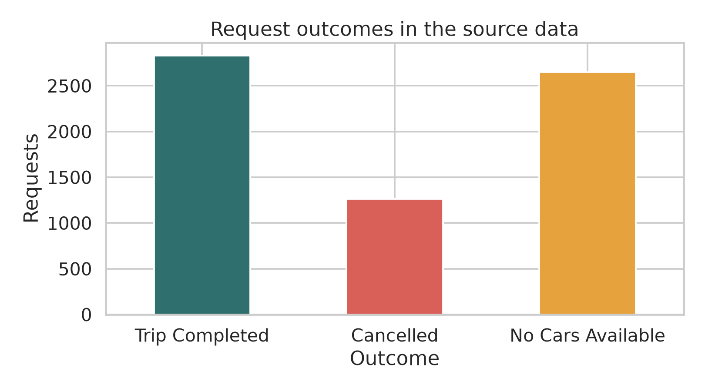
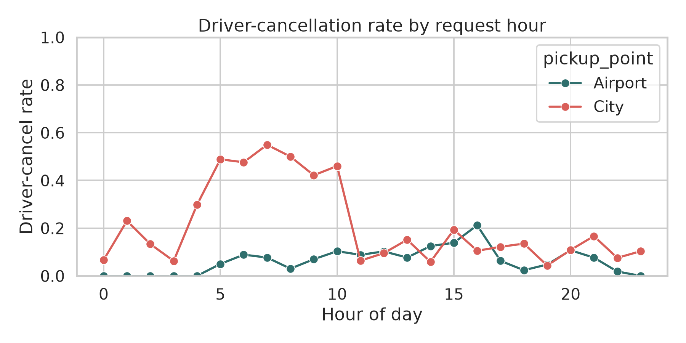
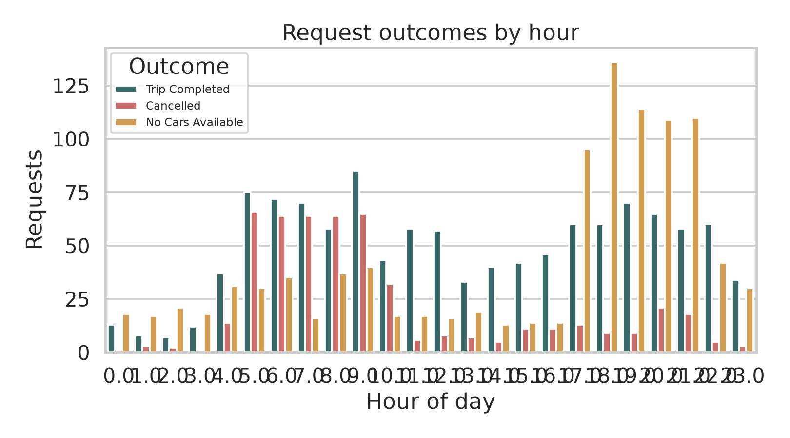
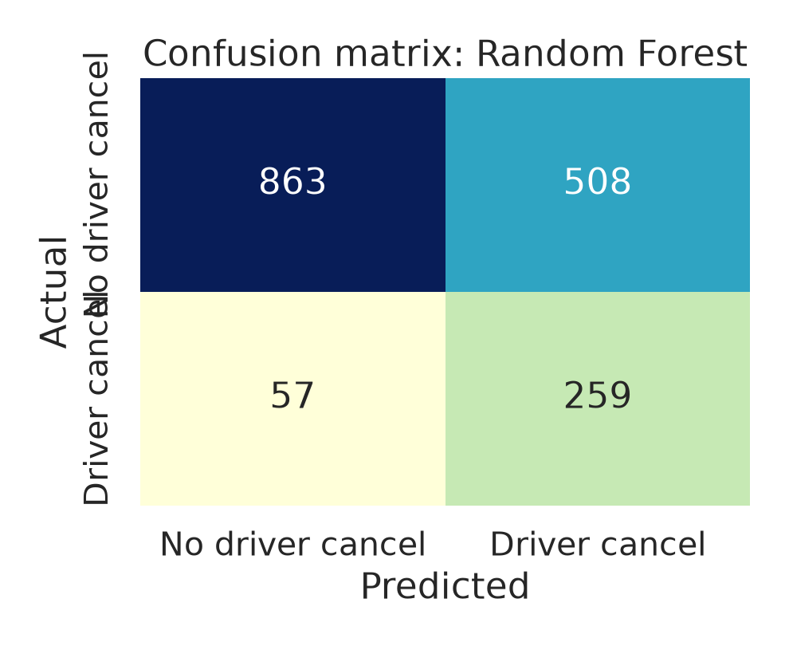
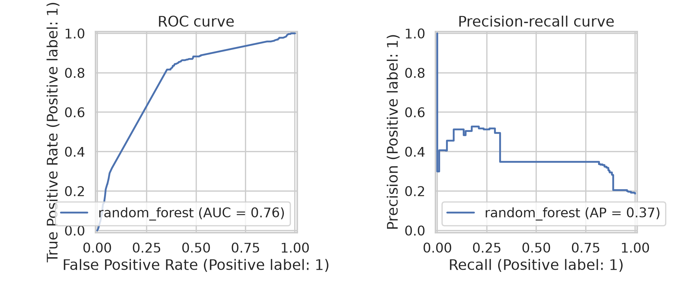

# Ride Cancellation Prediction

**Machine Learning Case Study 66**  
**B.Tech CSE 2024–28 | Semester V**

## 1. Problem definition

A ride-service provider loses time and revenue when a requested trip is later cancelled. The first practical question is whether the request itself contains enough information to flag higher-risk cases early.

This project treats the task as **binary classification**. For each ride request, the model predicts whether the historical record will have the status `Cancelled`. The prediction is made at request time. That restriction matters because fields such as driver ID and drop timestamp are known only after the request has progressed; including them would leak future information into the model.

The dataset also records `No Cars Available`. That outcome is reported in the exploratory analysis, but it is not folded into the cancellation label. A supply shortage and a recorded cancellation should lead to different operational responses.

### Project title

**Ride Cancellation Prediction from Request-Time Signals**

### Intended use

The score can support monitoring, staffing discussions, or a rider-facing service message when risk is high. It should not be used to punish a driver or rider. A probability is a screening signal, not a verdict.

## 2. Dataset and documentation

### Source

The project uses the public **Uber Request Data** dataset, a commonly used classroom dataset for analysing trip completion, cancellation, and supply gaps. A raw snapshot is included in `data/uber_request_data_raw.csv`.

- Public source mirror: [Uber Request Data.csv on GitHub](https://github.com/dittakaviram/Data-Science/blob/master/Uber%20Supply%20Demand%20Gap/Uber%20Request%20Data.csv)
- Direct file used for this project: [raw CSV](https://raw.githubusercontent.com/dittakaviram/Data-Science/master/Uber%20Supply%20Demand%20Gap/Uber%20Request%20Data.csv)
- The data covers request activity in July and November 2016.

### Fields in the source

| Field | Meaning | Use in this project |
|---|---|---|
| Request id | Identifier for the request | Audit only |
| Pickup point | City or Airport | Model feature |
| Driver id | Driver identifier when assigned | Excluded; missing for unassigned outcomes and not known at request time |
| Status | Trip Completed, Cancelled, or No Cars Available | Target and EDA |
| Request timestamp | Date and time of request | Transformed into hour, day, month, weekend |
| Drop timestamp | Trip completion time when available | Excluded; it is future information and missing for incomplete requests |

### Quality observations

The raw file contains **6,745 rows and six columns**. There are no duplicate rows. `Driver id` is missing in **2,650 rows**, which matches the unassigned `No Cars Available` records. `Drop timestamp` is missing in **3,914 rows**, which is expected for requests that did not complete. These two fields are therefore not imputed into the model.

The recorded outcomes are:

| Outcome | Requests | Share |
|---|---:|---:|
| Trip Completed | 2,831 | 42.0% |
| No Cars Available | 2,650 | 39.3% |
| Cancelled | 1,264 | 18.7% |

The prepared file keeps the original status and adds the derived target and request-time features. The transformation code is in `src/train.py`.

## 3. Exploratory data analysis

The outcome chart shows that completed trips are only a little over two-fifths of all requests. The large `No Cars Available` group is operationally important even though it is outside the cancellation target.



Cancellation patterns change across the day and by pickup point. This is plausible for a service with different airport and city demand cycles, but the chart should be read as an association in this dataset rather than a causal explanation.



The hourly outcome plot makes the supply problem visible alongside cancellations. A model trained only on the cancellation label cannot solve a no-car problem; the two outcomes deserve separate monitoring.



### Main observations

1. The class is imbalanced: only 18.7% of requests are labelled `Cancelled`.
2. Request hour and pickup point contain useful signal, so a request-time baseline is reasonable.
3. Missing driver and drop-time fields are structural, not random noise. They describe what happened after or during dispatch.
4. The data is historical and narrow. It does not include weather, traffic, fare, wait time, driver distance, customer history, or a full calendar year.

## 4. Preprocessing

The following steps are implemented in `src/train.py`:

1. Column names are normalised to lower-case snake case.
2. Request and drop timestamps are parsed with invalid values converted to missing.
3. The target is `1` for `Cancelled` and `0` for every other recorded outcome.
4. Request timestamp is expanded into hour, day of week, month, and weekend flag.
5. `pickup_point` and `day_of_week` are one-hot encoded.
6. Numeric variables are median-imputed and standardised inside a scikit-learn pipeline.
7. The data is split into 75% training and 25% test data using stratification and a fixed random seed of 42.
8. Class weights are balanced so the minority cancellation class is not ignored.

The preprocessing pipeline is fitted only on the training split. This keeps the hold-out evaluation separate from the fitting process.

## 5. Model development

Two models were compared:

- **Logistic regression:** a transparent linear baseline. It is useful for checking whether simple additive relationships are enough.
- **Random forest:** a non-linear ensemble that can capture interactions such as pickup point combined with time of day.

Both models use the same features and preprocessing. The selection criterion is average precision because the cancellation class is the operational focus and is relatively small. ROC-AUC is also reported for a threshold-independent view.

## 6. Evaluation and results

The hold-out test set contains **1,687 requests**. The selected model is the random forest.

| Model | ROC-AUC | Average precision | Precision | Recall | F1 | Accuracy |
|---|---:|---:|---:|---:|---:|---:|
| Random forest | 0.764 | 0.373 | 0.338 | 0.820 | 0.478 | 0.665 |
| Logistic regression | 0.752 | 0.353 | 0.313 | 0.858 | 0.458 | 0.620 |

At the default threshold of 0.50, the random forest finds about 82% of cancelled requests, but its precision is about 34%. That trade-off may be reasonable for early warning, where missing a high-risk request is more costly than reviewing extra alerts. A different operating threshold should be chosen with the service provider and an explicit cost model.





The model is better than a simple majority-class guess, but its probability estimates should not be over-interpreted. The strong recall comes with many false positives. Calibration, threshold selection, and a time-based validation split would be needed before operational use.

## 7. Streamlit application

The application in `app/streamlit_app.py` asks for five request-time inputs:

- pickup point;
- request hour;
- day of week;
- month;
- weekend status, derived from the selected day.

It displays the estimated cancellation probability and a plain-language risk label. The application also explains the model's scope and warns against using a score as a disciplinary decision.

Run it with:

```bash
pip install -r requirements.txt
python src/train.py
streamlit run app/streamlit_app.py
```

A screenshot and viva walkthrough are included in `evidence/`.

## 8. Error and result analysis

The model's most visible error is the false-positive group: requests predicted as cancellations that did not carry that label. This is expected when recall is prioritised on an imbalanced target. In practice, false positives could create unnecessary messages or staffing changes, so the alert threshold should be tied to a measurable cost.

The source label also has a boundary problem. A request with `No Cars Available` is a service failure, but it is not counted as a cancellation in this report. If the business objective is “will this request fail to produce a trip?”, a second model should be trained with a broader target that combines `Cancelled` and `No Cars Available`. That would answer a different question.

## 9. Limitations and next steps

- The data contains only two periods in 2016, so current behaviour cannot be assumed.
- The source has no weather, traffic, fare, driver distance, wait time, customer history, or supply count.
- A random split may place nearby requests from the same period in both train and test sets. A future project should add a time-based split.
- The data is observational. The model identifies associations; it does not show that changing pickup point or request time would cause a cancellation.
- The model has not been calibrated for production use.

A useful next collection round would add dispatch distance, estimated wait time, available-driver count, surge/fare information, weather, and a clearer cancellation reason. The evaluation should then use a chronological hold-out period and report cost-weighted results by pickup point and time band.

## 10. Conclusion

Request-time fields contain enough signal to rank cancellation risk in this classroom dataset. The random forest reached ROC-AUC 0.764 and recall 0.820 on the hold-out set, while precision remained modest at 0.338. The result supports a small Streamlit demonstration and a practical discussion of trade-offs. It does not support treating the score as a production decision without better data, temporal validation, calibration, and an agreed response to false alerts.
